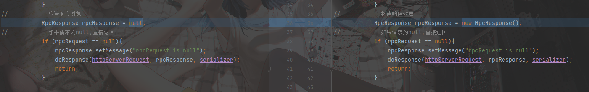

# Summery for RPC Framework Studying
###
___
## The introduce of this project
- waiting continue
___
## The question during study
### 1. the static proxy cannot get the service from the server
- the reason one is in the *RequestHandler*, there a new object as a parameter was written in the lambda as the action, but without using.
- the reason two is in the *Response Object*, I use it without new its object. There is no object, but I used it parameter method.
- and also, because of the problem one, the exe. cant run to the code where the problem two be. the compiler do not show the reason failed.

### 2. waiting continue